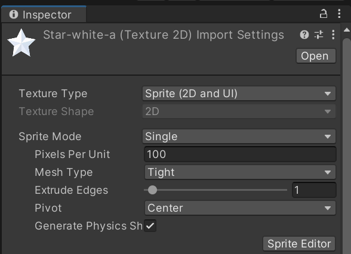
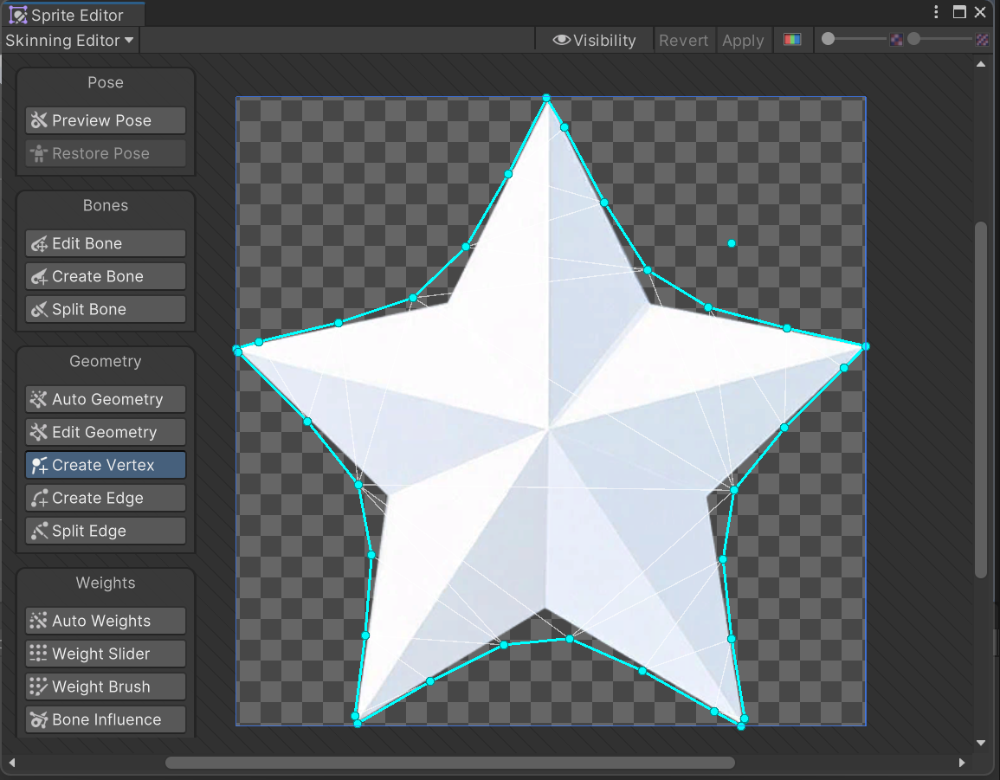

# Sprite to Column

## Usage

1. Make sure the sprite you use is correctly skinned in its sprite editor window like below:

2. Place your sprite images into your scene.
3. Drag `ImageToColumnGenerator.cs` to the game objects created after placing the sprite images, and set up their `Column Height` parameter.
4. Create a new empty game object (or use an existing one that won't be conflicting with other scripts), drag `ImageToColumnGenManager.cs` to it.
5. Play the game, and click on the "Generate Columns" button in inspector. After a few frames' blinking, boom, the 2D sprites are now in 3D column form.

If you prefer an API call, then simply call `GenerateColumns()` function in `ImageToColumnGenManager` class where ever you want in your code.

> Note: you can check out the example scene to directly try out the effect of this code.

## Known Problems

- The column mesh generated have a weird lighting and shading effect, which I currently don't know why since I haven't learned much about meshes and shaders...  :'(
- Also due to the reason above, I still haven't found a way to directly map 2D sprites onto the columns generated, and used a simple but silly way to make columns look like they have correct textures -- I simply put sprites in front of columns and make the columns children objects of sprites; in other words, this is just like giving columns masks to wear. XD
- You have to wait for a few frames after clicking on "Generate Columns" button or calling `GenerateColumns()` method, for all the sprites to be transformed into columns can't be processed in a single frame.

Reasons for problem no.3

In my code, the transformation process are required to be performed at world origin, i.e. sprites should all be located at`(0, 0, 0)` point, so if a sprite object is located at some other position of the world, it should be moved to world origin in advance. I tried moving it and then immediately call the generation function, but it turned out to be that the program still saw the sprite object at its original position. This might be because of Unity's mechanics handling object affine transformations is that, since when a line of transformation code is conducted, current frame has already begun and can no longer reflect objects' transformations, so the engine leaves all the transformations happened in current frame to be performed in the next frame. Thus, we cannot call the generation function immediately after calling position transformation, and can only leave the generation function to be called in the next frame.

